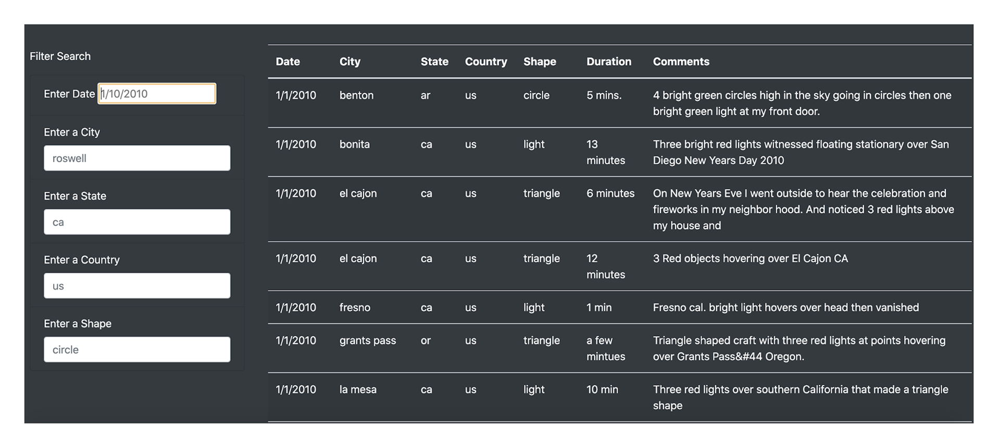
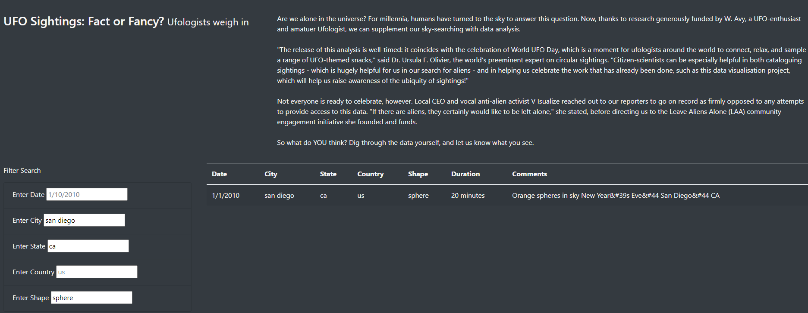

# UFO
Analysis Project using Javascript

## Overview of analysis
The purpose of this analysis was to allow users to use muitiple criteria to filter data out at the same time.

### How to use the code. 

The user is directed to the main page by opening the index.html file. From there, the user is presented with all the data collected from all the UFO sightings. 

 
To filter the data, the user must click any of the text boxes and enter the information into the boxes. In the example below, I selected a city, state, and shape to filter the data.
 

 
# Summary 

This works pretty well, but there are drawbacks. It would be nice to not have to load all the data at once to make the loading screen faster. Also, it would be beneficial to add a query that returns no data instead of just a blank screen. Since the data is so small, we can manage for now, but more UFO sightings are happening as I speak. 
